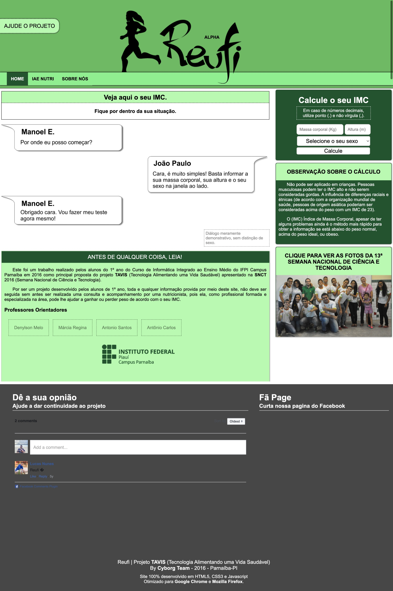

# Reufi

https://jjpaulo2.github.io/reufi

> Projeto desenvolvido pelos alunos do 1º ano do curso integrado ao médio de Informática do IFPI - Campus Parnaíba para apresentação na Semana Nacional de Ciência e Tecnologia de 2016.

Obrigado ao professor [@denylsonmelo](https://github.com/denylsonmelo) por ter me orientado e ajudado a dar os primeiros passos no mundo do desenvolvimento web.

Este projeto vai ser mantido aqui apenas como peça de um museu pessoal.

### Screenshot

